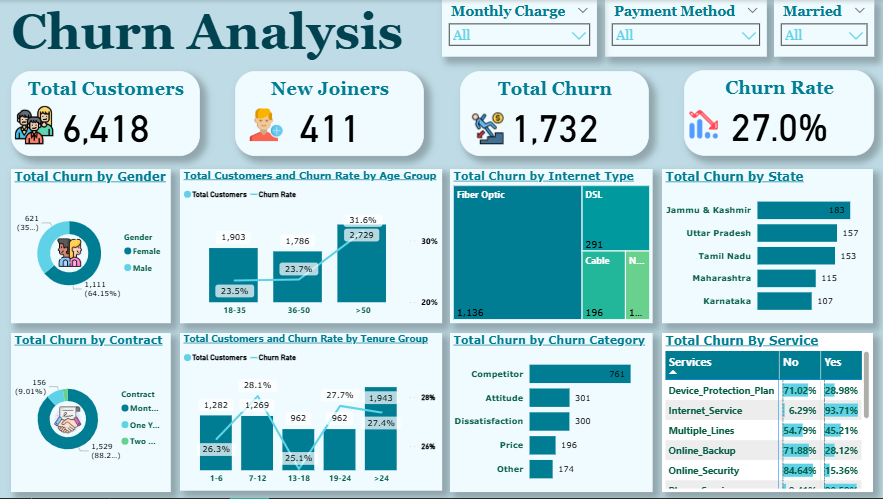

# Churn-Analysis-Dashboard

## Description

Interactive churn dashboard for a telecom company using SQL server and Power BI (Power query and DAX).

This dashboard focuses on churn analysis across different age groups, genders, states, contracts types, payment methods and services.

## Data & Tools Used

**Data** - Customer Data containing over 6400 records.

**Data Source** - [[Customer_Data.csv]](Customer_Data.csv)

**Data Cleaning & Analysis** - SQL server & Power Query [null_exploring.sql](null_exploring.sql) / [prod_table.sql](prod_table.sql) / [grouping.sql](grouping.sql)

**Data Visualization** - Power BI [Churn_Analysis.pbix](Churn_Analysis.pbix)

## Objective

Identify the reasons behind the increase in customer churn. It also aims to find effective strategies to reduce churn and improve customer retention. 

 ## Key Insights
 
- Total churn is 1732 customers, representing 27% of total customers.
- About 88% of churned customers were on Month-to-Month contracts.
- Only 12% of churned customers had one-year or two-year contracts, despite representing about half of all customers (49%).
- Customers on Month-to-Month contracts are 17x more likely to churn compared to two-year contract customers (46.5% --> 2.7%).
- Customers with internet service are 4x more likely to churn compared to customers without internet service (32.3% --> 7.8%).
- Fiber optic service shows the highest churn rate among internet types (41.1%).
- Customers with monthly charges between 50 and 100 have the highest churn rate and represent the largest segment (33.3%), while customers with charges under 20 show the lowest churn rate (11.9%).
- Payment by mailed check is associated with the highest churn rate, at 37.8%, while payment by credit card has the lowest churn rate, at 14.8%.
- Payment by bank withdrawal also has a similarly high churn rate, at 34.4%, and it also represents the largest customer segment.
- The 7-12 months Tenure group has the highest churn rate (28.1%).
- 64% of churned customers are female.
- About 50% of churned customers are above 50 years old, which is higher than the expected average, as their rate among all customers is 42.5%.
- Jammu & Kashmir has the highest churn rate among all states (57.2%). 77% of churned customers in this state attributed their churn to the competitor offers.

## Root Causes

- Competition: Competitors offer better devices, deals, more data and high download speeds. 
- Service Quality: Issues in internet service particularly fiber optic type, network reliability, limited range of services and poor support.
- Customer Support: Negative experiences with staff and service provider behavior.
- Pricing: Dissatisfaction with long-distance and extra-data charges.

## Recommendations

- Improve user experience by introducing competitive offers, upgrading device quality and increasing data packages to achieve a 10% increase in customer retention within 6 months.
- Enhance Internet quality specifically for fiber-optic type by improving network performance, reducing latency and increasing internet speeds. 
- Strengthen network reliability by adding more access points, decreasing downtime by at least 15%, and expanding service coverage to reach more areas.
- Improve online and phone support by conducting regular training sessions to enhance the skills of our technical support staff and customer satisfaction.
- Reevaluate pricing strategy, particularly long-distance and extra data charges and introduce competitive pricing plans.
- Offer strong incentives to attract customers to long-term contracts (1-2 years) to boost customer retention.
- Optimize bank withdrawal and mailed check payments by enhancing support, simplifying the payment process, and speeding up transaction times, to reduce churn in these segments.
- Support the customer segment paying between 50 and 100 monthly charges by offering loyalty incentives and special deals.
- Prioritize high-risk segments such as female customers and customers above 50 years old by offering customized rewards and service enhancements.
- Design special offers for 'Jammu & Kashmir' by creating exclusive deals, rewards, and customized incentives for this region to bring these customers back and reduce churn from 57% to 35% within 6 months. 
